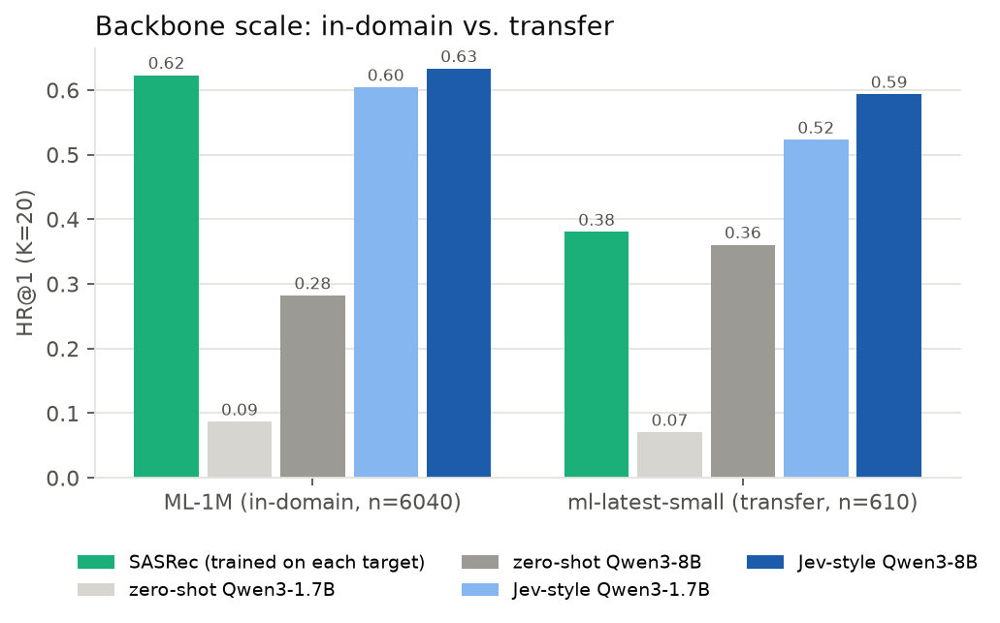
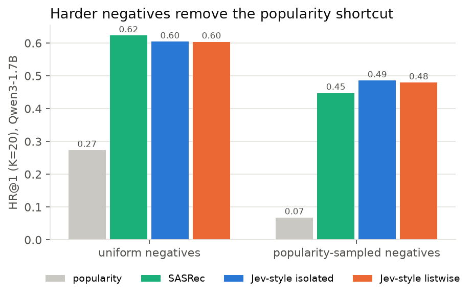
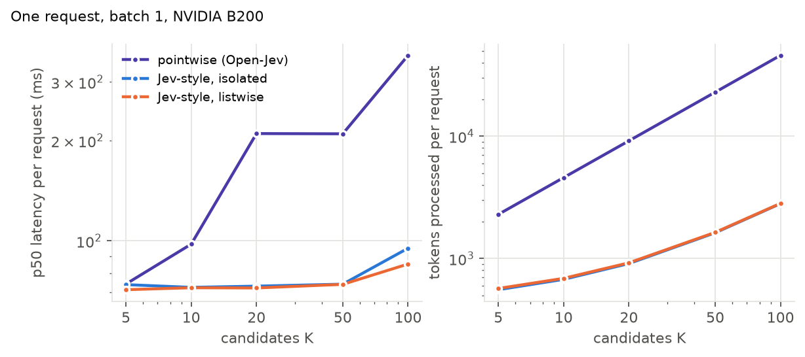
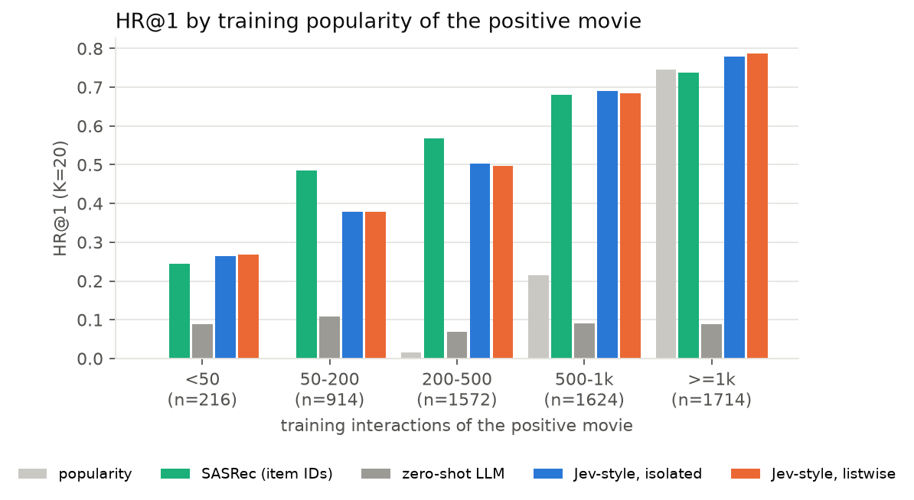
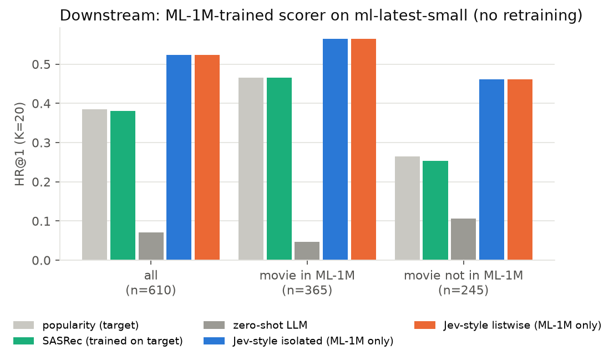
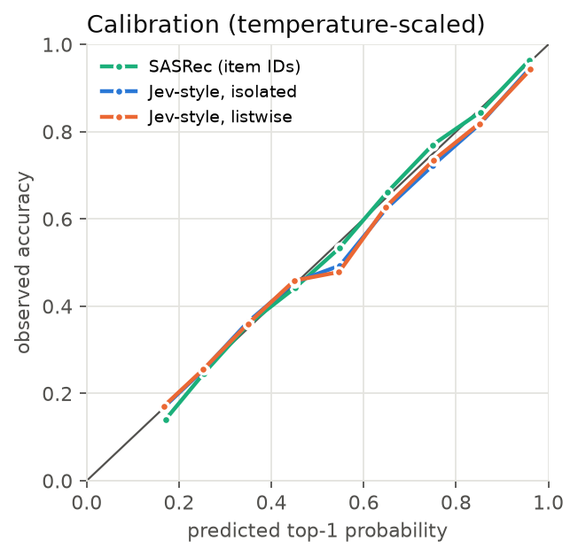

# jev-recommend

**Jev-style typed decision models used as recommenders.** A user's history is the
shared *state*, K candidate items are the options of one `Choice` question, and an
LLM returns a calibrated probability for every candidate in a single forward pass,
with no generated text. We compare three ways to score candidates on the same
backbone, train them on MovieLens-1M, and test them downstream on a newer
catalogue they have never seen.

Blog post: <https://wdlctc.github.io/jev-recommend.html> ·
Interactive demo: <https://wdlctc.github.io/jev-decision-desk.html> (replays the saved test predictions)

| scoring mode | what it is | state encoded | candidates see each other |
|---|---|---|---|
| `pointwise` | Jev pointwise: one sequence per (state, candidate), scalar readout at the last token | K times | no |
| `isolated` | one sequence per request, **block attention mask** + position ids restarting after the state | once | no |
| `listwise` | `isolated` + a trailing *decide* segment that attends to all candidates, low-rank bilinear term (zero-initialised) | once | through the decide token |

`isolated` computes **exactly the same function** as `pointwise`
(`tests/test_model.py` checks this in fp32 for eager and SDPA attention), so it
is a drop-in replacement that encodes the state once, during training too, not
only at inference with a prefix cache.

All modes read a scalar with a head initialised to `W_yes − W_no` of the
pretrained unembedding (the zero-shot Yes/No margin), fine-tune LoRA (r=16) on
the backbone, and optimise softmax cross-entropy over the K candidates plus
0.1 × Brier. One temperature is fitted on validation afterwards.

## Results (Qwen3-1.7B and Qwen3-8B, 1 epoch, 48k training decisions)

MovieLens-1M, leave-one-out test (6,040 users), K = 20 candidates (1 positive +
19 random unseen movies), identical candidate sets for every model. All numbers
after validation-fitted temperature scaling.

| model | HR@1 | HR@5 | NDCG@10 | MRR | NLL | ECE | auto-decidable @95% precision | tokens / request |
|---|---|---|---|---|---|---|---|---|
| popularity | 0.274 | 0.695 | 0.558 | 0.460 | 2.33 | 0.025 | 0.0% | – |
| SASRec (item IDs) | 0.623 | 0.899 | 0.799 | 0.746 | 1.25 | **0.013** | 22.9% | – |
| zero-shot LLM, pointwise | 0.084 | 0.357 | 0.303 | 0.236 | 2.95 | 0.002 | 0.0% | 9,124 |
| zero-shot LLM, isolated | 0.087 | 0.365 | 0.304 | 0.237 | 2.95 | 0.005 | 0.0% | 910 |
| Jev-style, isolated | 0.604 | 0.894 | 0.785 | 0.731 | 1.29 | 0.023 | 20.5% | **910** |
| same weights, pointwise | 0.605 | 0.894 | 0.786 | 0.732 | 1.29 | 0.023 | 20.6% | 9,124 |
| Jev-style, listwise | 0.604 | 0.894 | 0.785 | 0.732 | 1.29 | 0.026 | 18.6% | 923 |
| *Qwen3-8B* zero-shot, isolated | 0.282 | 0.670 | 0.544 | 0.459 | 2.35 | 0.018 | 0.4% | 910 |
| *Qwen3-8B* Jev-style, isolated | **0.633** | **0.906** | **0.804** | **0.754** | **1.19** | 0.022 | **26.9%** | 910 |
| *Qwen3-8B* Jev-style, listwise | 0.633 | 0.906 | 0.804 | 0.753 | 1.19 | 0.026 | 26.0% | 923 |

Paired against SASRec on the same 6,040 requests (McNemar, bootstrap 95% CI of the
HR@1 difference): Qwen3-1.7B −1.9 points (p = 0.002, CI [−3.0, −0.8]);
Qwen3-8B +1.0 points (p = 0.07, CI [−0.05, +2.1]), i.e. on par.

*auto-decidable @95%*: the largest share of requests, sorted by confidence,
whose top-1 is still ≥ 95% correct. This is the "automate the confident ones,
escalate the rest" operating point that calibrated decisions are meant for.

**Downstream transfer**: scorers trained only on ML-1M, applied unchanged to
`ml-latest-small` (2018 catalogue, 610 users). 245 of the 610 test positives
are movies that are not in ML-1M (228 of them released in 2000 or later). Popularity and SASRec are trained on the
target dataset itself.

| model | HR@1 all (n=610) | movie in ML-1M (n=365) | movie not in ML-1M (n=245) |
|---|---|---|---|
| popularity (target) | 0.385 | 0.466 | 0.265 |
| SASRec (trained on target) | 0.380 | 0.466 | 0.253 |
| zero-shot LLM | 0.070 | 0.047 | 0.106 |
| **Jev-style isolated (ML-1M only)** | **0.523** | **0.564** | **0.461** |
| Jev-style listwise (ML-1M only) | 0.523 | 0.564 | 0.461 |
| *Qwen3-8B* zero-shot | 0.361 | 0.381 | 0.331 |
| *Qwen3-8B* **Jev-style isolated (ML-1M only)** | **0.593** | **0.619** | **0.555** |
| *Qwen3-8B* Jev-style listwise (ML-1M only) | 0.585 | 0.608 | 0.551 |

Rows without a model tag are Qwen3-1.7B. Both transfer gains over SASRec are
significant (McNemar p = 3e-8 for 1.7B, 6e-16 for 8B).

**Hard negatives**: the same Qwen3-1.7B setup, but the 19 negatives are sampled
proportionally to popularity (median negative popularity 562 vs 107 for uniform),
which removes the "recommend what is popular" shortcut.

| model | HR@1 | HR@5 | NDCG@10 | NLL | ECE | auto @95% |
|---|---|---|---|---|---|---|
| popularity | 0.068 | 0.294 | 0.253 | 3.00 | 0.015 | 0.0% |
| SASRec | 0.448 | 0.795 | 0.671 | 1.84 | 0.026 | 5.8% |
| zero-shot LLM | 0.084 | 0.341 | 0.296 | 2.96 | 0.005 | 0.0% |
| **Jev-style, isolated** | **0.486** | 0.806 | **0.693** | 1.69 | **0.017** | 11.4% |
| Jev-style, listwise | 0.480 | **0.806** | 0.693 | **1.68** | 0.019 | **11.6%** |

Isolated vs SASRec: +3.8 points (McNemar p = 1.5e-9, CI [+2.5, +5.0]).
Listwise vs isolated: −0.6 points top-1 (p = 0.03).

**Latency**, one request, batch 1, B200, HF eager + SDPA, three modes sharing one
backbone and timed interleaved over 60 requests. min / p50 ms (tokens):

| mode | K=5 | K=10 | K=20 | K=50 | K=100 |
|---|---|---|---|---|---|
| pointwise | 23 / 72 (2,286) | 33 / 84 (4,571) | 57 / 112 (9,143) | 141 / 203 (22,851) | 286 / 356 (45,711) |
| isolated | 21 / 22 (553) | 21 / 70 (672) | 22 / 22 (911) | 22 / 72 (1,620) | 27 / 88 (2,816) |
| listwise | 22 / 22 (566) | 22 / 71 (685) | 22 / 23 (924) | 22 / 26 (1,633) | 28 / 93 (2,829) |

The box is shared: individual requests intermittently stall by ~50 ms (host
load), which makes p50 bimodal. The minimum is the uncontended number. A 28-layer
model in eager PyTorch has a ~21 ms launch floor, so the masked modes stay flat
up to K=50, while pointwise grows with K·(state + candidate).








### What we learned

1. **The block mask costs no accuracy and is ~10× cheaper.** Same weights,
   same metrics to bf16 noise, 10× fewer tokens at K=20 and 16× at K=100
   (2.6× / 10.6× lower uncontended latency). The Jev pointwise layout pays for
   re-reading the user state once per candidate.
2. **Letting candidates compete did not help, even with hard negatives.** The
   listwise term learns non-trivial weights (it flips 8% of top-1 decisions)
   but gains nothing with uniform negatives and loses 0.6 points top-1 with
   popularity-sampled ones.
3. **In-domain, ID models remain strong, partly through popularity.** With
   uniform negatives SASRec beats the 1.7B LLM by ~2 points and ties the 8B
   one. The LLM wins on the least popular positives (<50 training interactions)
   and on the most popular ones, and loses in the middle band where ID
   embeddings are well trained. With popularity-sampled negatives, which make
   popularity useless (0.07 HR@1), the 1.7B LLM beats SASRec by 3.8 points.
4. **Text transfers, IDs do not.** Trained on ML-1M only, the LLM scorer beats a
   SASRec trained on the target data by 14 (1.7B) / 21 (8B) points, and by
   21 / 30 points on movies that are not in ML-1M at all (93% released after
   it was collected). The 8B zero-shot readout alone (0.361) is nearly as good as the
   in-domain SASRec (0.380).
5. **Calibration is cheap.** Raw ECE 0.07 → 0.023 with one temperature (T≈1.2).
   Both SASRec and the LLM are well calibrated after that; neither is a reason
   to prefer the other.

## Reproduce

```bash
pip install -e .            # torch, transformers>=4.56, peft
python -m pytest -q tests   # mask/position equivalence checks, CPU, ~5 s

# full suite on 4 GPUs (downloads MovieLens + Qwen3 weights)
GA=0,1 GB=2,3 bash scripts/run_all.sh          # train isolated + listwise, zero-shot, baselines, bench
bash scripts/run_downstream.sh                  # transfer to ml-latest-small
python scripts/summarize.py runs/q17b           # tables
python scripts/analyze.py runs/q17b figures     # slices + figures
MODEL=Qwen/Qwen3-8B TAG=q8b SKIP_POINTWISE=1 bash scripts/run_all.sh   # 8B point
```

Single run: `torchrun --nproc-per-node 2 -m jevrec.train --mode isolated --out runs/iso`.
Evaluate saved weights in another mode: `--epochs 0 --init-from runs/iso/trainable.pt --mode pointwise`.

Trained LoRA + head weights (`trainable.pt`) and all logits are attached to the
[GitHub release](https://github.com/wdlctc/jev-recommend/releases).

## Layout

```
jevrec/data.py       MovieLens loaders, leave-one-out Choice records, fixed-seed negatives
jevrec/prompts.py    state / candidate / decide text segments, tokenised once
jevrec/model.py      packing, block mask, DecisionScorer (pointwise | isolated | listwise)
jevrec/train.py      DDP training, sharded eval, temperature fit
jevrec/metrics.py    HR/NDCG/MRR, NLL, Brier, ECE, auto-decidable coverage
jevrec/baselines.py  popularity and SASRec on the same candidate sets
jevrec/bench.py      per-request latency sweep over K
runs/                results.json per run (logits in the release)
```

## Caveats

- Sampled negatives, K=20 (uniform, plus a popularity-sampled variant): easier than
  full-catalogue ranking; all models share each protocol.
- One seed per configuration. With 6,040 test users the 95% CI on HR@1 is about ±0.012;
  on the 610-user transfer set about ±0.04.
- The mask-based modes need pure-attention backbones (Qwen3). Linear-attention / SSM
  layers (e.g. Qwen3.5 Gated DeltaNet) ignore attention masks; there you need one row
  per candidate plus a forked state cache, as existing open reimplementations do.
- This is an independent study inspired by TypeSafe's Jev. It does not use or
  reproduce Jev's weights, data or RLCD training.

## Acknowledgements

Our implementation builds on existing open reimplementations of Jev, including
[Open-Jev](https://github.com/Zefan-Cai/Open-Jev) (per-candidate scoring with a
Yes/No-initialised scalar head, which our `pointwise` mode follows) and
[kev](https://github.com/jaredpalmer/kev) (question isolation via attention masking
with per-question position ids, and a decide-token readout, which our `isolated`
and `listwise` modes follow).

## License

Apache-2.0. MovieLens data is subject to the
[GroupLens terms](https://files.grouplens.org/datasets/movielens/ml-1m-README.txt) and is
downloaded, not redistributed.
